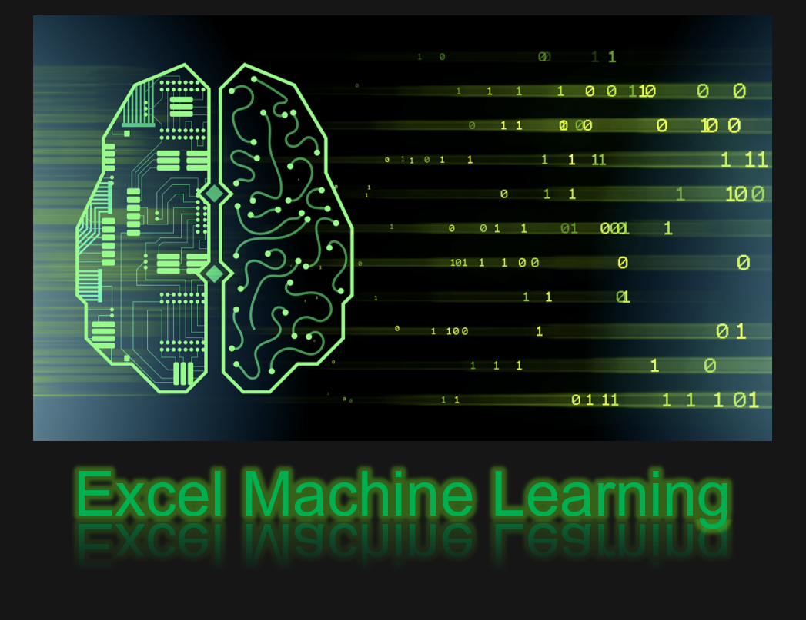

## Description:

#### Machine Learning is a system or computer programming that can learn from data.  

### Basic Machine Learning Algorithms  
### Commonly Used:  
#### (1) Linear Regression
#### (2) Logistic Regression  
#### (3) Decision Tree  
#### (4) Support Vector Machine (SVM)      
#### (5) Naive Bayes 
#### (6) K Nearest Neighbor (KNN)  
#### (7) K-Means  
#### (8) Random Forest  

## Author  
### * Tin Hang  

## 🔴 Warning: This is not financial advisor.  Do not use this to invest or trade. It is for educational purpose.  
