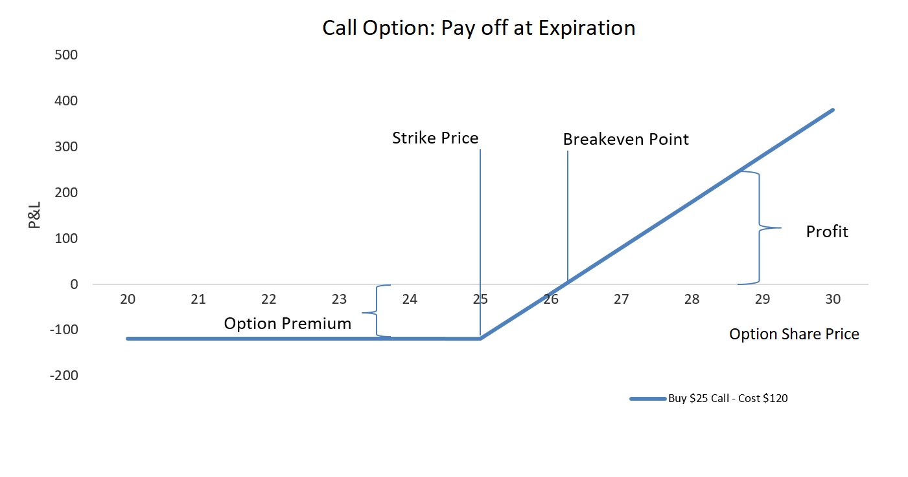
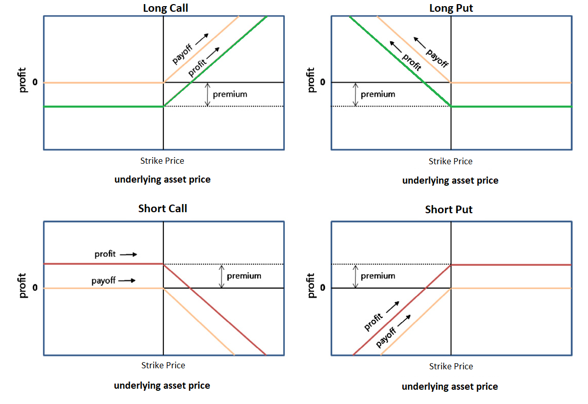
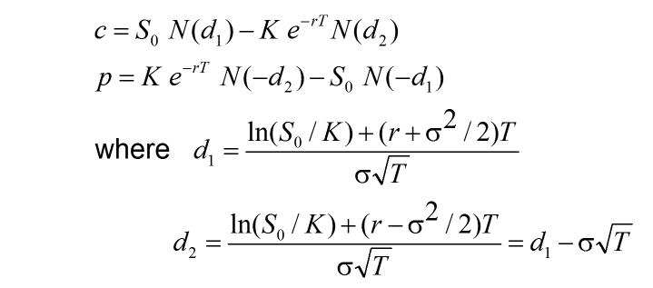

# Excel for Options Trading and Investment

## Description:  
Learn about options trading in Excel. Learn how to input options in Excel. Learn to create option strategies. Options is risker than investing in stocks.   
  

### Last: Shows the price of the most recent trade that went through.  
### Chg (Change): Shows the change is how much the Last price has changed since the previous close.  
### Bid: Shows when you're buying an option, you usually pay the ask price. The price at which buyers are trying to buy the option. 
### Ask: Shows when you're selling, or writing, an option, you usually receive bid amount. The price at which sellers are trying to sell the option.  
### Volume (Actual Trades): Shows you how many contracts have traded during the market day's traded session.  
### Open Interest (Open Contracts): Shows the total number of outstanding option contracts that are still open. 
### Strike Prices: Shows the price at which a call or put buyer can purchase the security if the option is exercised. 
   

## What is options?  
Options is a contract that gives the buyer the right, but not the oblication, to buy or sell an underlying asset at a specified strike price to a specified date.  

### List of different types of analyzing options and options strategies  
Options analysis is a method for investors use for to buy call and put; therefore, traders make decision in buying and selling. 

### Two types of options:
1.) American options can be exercised at any time between the date of purchase and the expiration date.  
2.) European options are different from American options in that they can only be exercised at the end of their lives on their expiration date.  

#### Call option gives the holder the right to buy a stock.  
#### Put opton gives the holder the right to sell a stock.   

#### Risk-neutral Probability  
- Probability of future outcomes adjusted for risk. There are two main assumptions behind this concept:  
1.) The current value of an asset is equal to its expected payoff discounted at the risk-free rate.  
2.) There are no arbitrage opportunities in the market.  

#### Binomial Option Pricing Model  
- The simplest method to price the options for this model. This model uses the assumption of perfectly efficient market; however, the model can price the option at each point of a specified time frame. The binomial model, we consider that the price of the underlying asset will either go up or down in the period. Given the possible prices of the underlying asset and the strike price of an option, we can calculate the payoff of the option under these scenarios, then discount these payoffs and find the value of that option as of today.  

### Brokerages to represent  
#### "buy to open"
- to buy long call or put options in the underlying security. The option premium is immediately debited from your account.  
#### "sell to open" 
- selling or establishing a short position in an option. Options writing and collect premium because selling the rights of the option to another market participant.  
#### "sell to close" 
- used to exit a trade in which the trader already owns the options contract and must sell the contract to close the position. Traders "sell to close" call options contracts they own when they no longer want to hold a long bullish position on the underlying asset(Investopedia).  
#### "buy to close" 
- a trader is net short an option position and wants to exit that open position. In other words, they already have an open position, by way of writing an option, for which they have received a net credit, and now seek to close that position (Investopedia).  

### Understanding Binary Basics  
####  At the money (ATM) 
- is an option whose strike price is near where the stock price is currently; therefore, primarily made up of intrinsic value, with very little extrinsic value.  
#### In the Money (ATM) 
- is an option whose strike price is below where the stock price is currently; as a result, it has little to no intrinsic value.    
#### Out of the Money (OTM) 
- is an option with strike price is above where the stock price is currently and the option is made up of entirely extrinsic value.  

## Options Strategies    
1. Long Call
2. Long Put
3. Short Put
4. Covered Call  
5. Married Put  
6. Bull Call Spread  
7. Bear Put Spread  
8. Protective Collar  
9. Long Straddle  
10. Long Strangle  
11. Long Call Butterfly Spread  
12. Iron Condor  
13. Iron Butterfly    

## Options Greeks   
1. Delta - Measures change in option price when stock price moves  
2. Gamma - Measures change in delta when stock price moves  
3. Vega - Measures change in option price when volatility moves  
5. Theta - Decay in option price every day as the expiration gets nearer  
6. Rho - Measures change in option price when stock price moves  

## Black Scholes Model  
### Equations:  
  
  
Black Scholes model or Black-Scholes-Merton (BSM) model, is a mathematical model for pricing an options contract. Therefore, the equation derives the price of a call option or put option.  

## Options Pricing
Intrinsic Value (Calls) = Current Stock Price - Stock Price  
Intrinsic Value (Puts) = Strike Price - Current Stock Price  
Time Value = Option Premium - Intrinsic Value  

https://www.investopedia.com/trading/options-strategies/

## Will add more options strategies 

## Author:    
### Tin Hang  

## References:  
https://www.investopedia.com/trading/options-strategies/  
https://www.optionsplaybook.com/option-strategies/  

:red_circle: Warning: This is not financial advisor.  Options is a high risk for investing and trading.  Do not use this to invest or trade. It is for educational purpose.  

