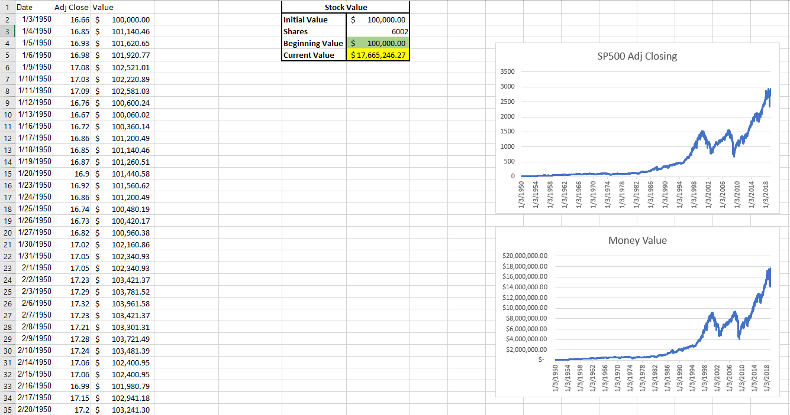

# Excel Portfolio Strategies  

## Descriptions:
####  Portfolio Strategies is the art and science of selecting and overseeing a group of investments such as stocks, bonds, mutual funds, and options that meet the long-term financial objectives and risk tolerance. Create different types of portfolio and invest in multiple stocks that affect you during that year. For example, invest in stocks that have a big impact during coronavirus time. However, it requires the ability to weigh strengths and weaknesses. Therefore, it involves trade-offs, from debt versus equity to domestic versus international and growth versus safety.  

## Author  
### * Tin Hang  

## 🔴 Warning: This is not financial advisor.  Do not use this to invest or trade. It is for educational purpose.  
