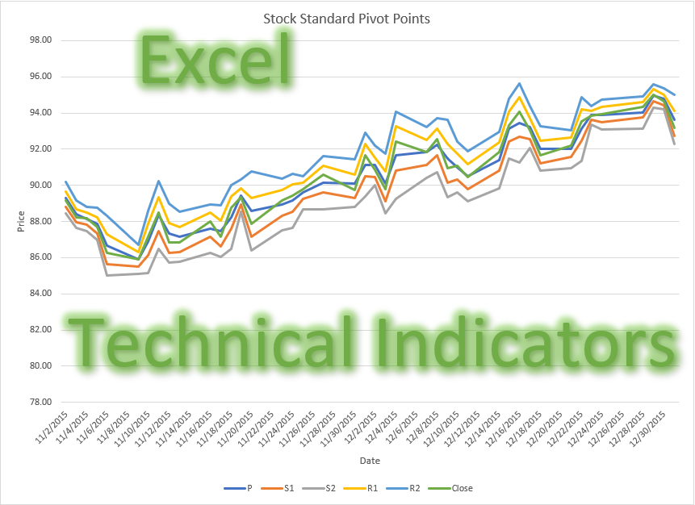

# Technical Analysis Indicators
Description: Technical Analysis (TA) and Pivot Points (PP) is a method to analyze securities prices (or stock's price) and predict or forecast the price based on the TA. TA tells you when to buy and sell.    

## References:
https://www.investopedia.com/terms/t/technicalindicator.asp  
https://stockcharts.com/school/doku.php?id=chart_school:technical_indicators  
https://www.investopedia.com/terms/p/pivotpoint.asp  
https://stockcharts.com/school/doku.php?id=chart_school:technical_indicators:pivot_points  
https://www.tradingtechnologies.com/xtrader-help/x-study/technical-indicator-definitions/list-of-technical-indicators/  

## Author  
### * Tin Hang  

## 🔴 Warning: This is not financial advisor.  Do not use this to invest or trade. It is for educational purpose.  

