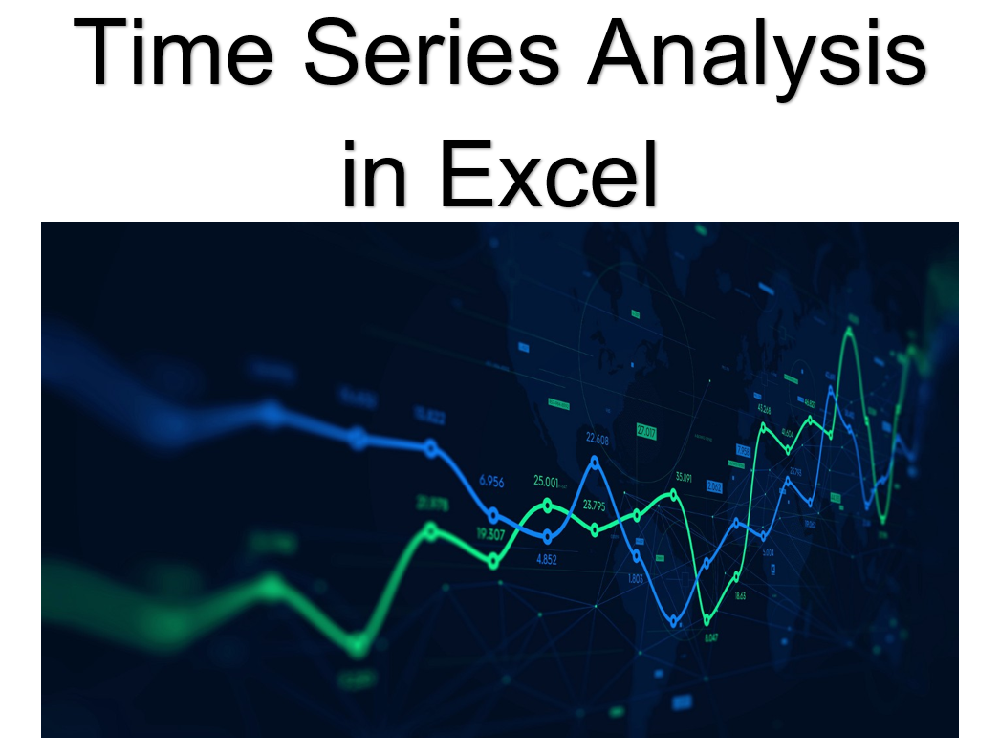

# Time Series Forecasting in Excel  

## Description:  
Time series forecasting is use for scientific predictions based on historical time stamped data. Building or developing models through historical data analysis and using them to make observations and drive future strategic decision-making.  

Time series analysis is a statistical technique that analyze time series data or trend data. Time series data is a group of observations on a single entity over time; for example, the daily closing prices over one year for a single financial security.  

Time series analysis shows how data changes over time, and forecasting can identify the direction in which the data is changing.  

## Purpose:  
A time series is a dataset that helps to identifying the nature of the phenomenon represented by the sequence of observations, and forecasting (predicting future values of the time series variable).   

## Step-by-Step Time Series Analysis:  
### Step 1: Making Data Stationary
   1. Type of data?  
      a. Trend <- sales   
      b. Seasonal <- good for sales or funding data (Common)    
      c. Cyclical <- sales  
      d. Irregular (Random)  
   2. If not, make it to stationary.  
      a. first difference (Current – previous)       
           
      b. second difference  
           
      
      c. general difference     
        
      
### Step 2: Building Your Time Series Model
   1. Exponential smoothing  
   2. Autoregression (AR)  
   3. Moving Average (MA)  
   4. Autoregressive Moving Average (ARMA)  
   5. Autoregressive Integrated Moving Average (ARIMA)  
   6. Seasonal Autoregressive Integrated Moving-Average (SARIMA)   
### Step 3: Evaluating Model Accuracy
   1. Errors or Bias  
   2. Mean Absolute Deviation (MAD)  
   3. Mean Square Error (MSE)  
   4. Mean Absolute Percent Error (MAPE)  
   
### Time Series Forecast Error Metrics  
#### Scale-Dependent Metrics  
   1. Mean Absolute Error (MAE)  
   2. Mean Squared Error (MSE)  
   3. Root Mean Square Error (RMSE)  
#### Percentage-Error Metrics  
   1. Mean Absolute Percentage Error (MAPE)
   2. Symmetric Mean Absolute Percentage Error (SMAPE)  
#### Relative-Error Metrics  
   1. Median Relative Absolute Error (MdRAE)  
   2. Geometric Mean Relative Absolute Error (GMRAE)  
#### Scale-Free Error Metrics  
   1. Mean Absolute Scaled Error (MASE)  

#### ACF and PACF  
Autocorrelation Function (ACF) and Partial Autocorrelation Function (PACF) The ACF and PACF are used to figure out the order of AR, MA, and ARMA models.  

#### ARIMA Models  
ARIMA (Auto Regressive Integrated Moving Average) is a class of models that explains a given time series based on its own past values. The lags and the lagged forecast errors is the equation that can be used to forecast future values. 

ARIMA model has 3 characterized terms: p, d, q.  

The 'p' is the order of the AR term, 'q' is the order of the MA term, and 'd' is the number of differencing required to make the time series stationary.

If a time series, has seasonal patterns, then you need to add seasonal terms and it becomes SARIMA, short for ‘Seasonal ARIMA’. More on that once we finish ARIMA.  

In time series, the first step to build an ARIMA model is to make the time series stationary. The most common method is to defference it. For example, subtract the previous value from the current value.  However, the data might need more than one differencing because the complexity of the series. The value of 'd' is the minimum number of differencing needed to make the series stationary. If the time series is already stationary, then d = 0. The 'p' is the order of the 'Auto Regressive' (AR) term and is the number of lags of Y to be used as predictors. The 'q' is the order of the 'Moving Average' (MA) term and is the number of lagged forecast errors that should go into the ARIMA Model.        

### Auto Regressive (AR only) model Equations:  

   
#### Moving Average (MA only) model is one where Yt depends only on the lagged forecast errors.  

### Moving Average (MA only) model Equations:  
  

### Error Terms   
Error terms are the errors of the autoregressive models of the respective lags.  

### Error Terms Equations:    

  

  

### ARMA  
ARMA (Auto Regressive Moving Average) is a model that is combined from the AR and MA models. In this model, the impact of previous lags along with the residuals is considered for forecasting the future values of the time series.  

### ARMA Equations:

### ARIMA  
ARIMA is a model where the time series was differenced at least once to make it stationary; therefore, you combine the AR and the MA terms. 

### ARIMA Equations:    

  
## Author  
### * Tin Hang  

## 🔴 Warning: This is not financial advisor.  Do not use this to invest or trade. It is for educational purpose.  
