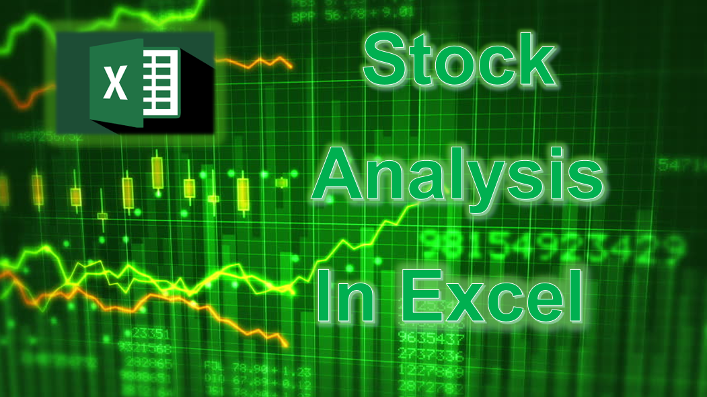

# Excel for Stock Trading and Investment  

## Description:
This Excel project has technical analysis, fundamental analysis, quantitative analysis, and different types of trading strategies. Many different types of risk-returns metrics, technical indicators and portfolio strategies. In addition, it has data analysis and data science for single stock and multiple stocks. Using statistical analysis such as hypothesis testing, t-test, R-Squared, Significant F, p-value, coefficient, F test and Durbin-Watson statistic for investing and trading. Creating VBA, macros, and complex formulas for stock analysis.    

### List of Stock Strategies and Investment  
List of Technical Analysis  
Fundamental Analysis (Statements)  
Budgeting Money for Investing  
Project of Portfolio Stocks Investment  
Project of Values in the Company (Cashflows)  
Stock Data Analysis  
Stock Measurement Ratios  
Long-Term Investment  
Statistics  
Time Series  
Forecasting  

### Trading Stocks in Statistics  
Trading With Gaussian Statistical Models  
Hypothesis Testing in Finance  
Independent Sample t-Test for Stock Returns  
Statistical Modeling  
Statistical Inference  

## Author
### * Tin Hang

## 🔴 Warning: This is not financial advisor.  Do not use this to invest or trade. It is for educational purpose. 
