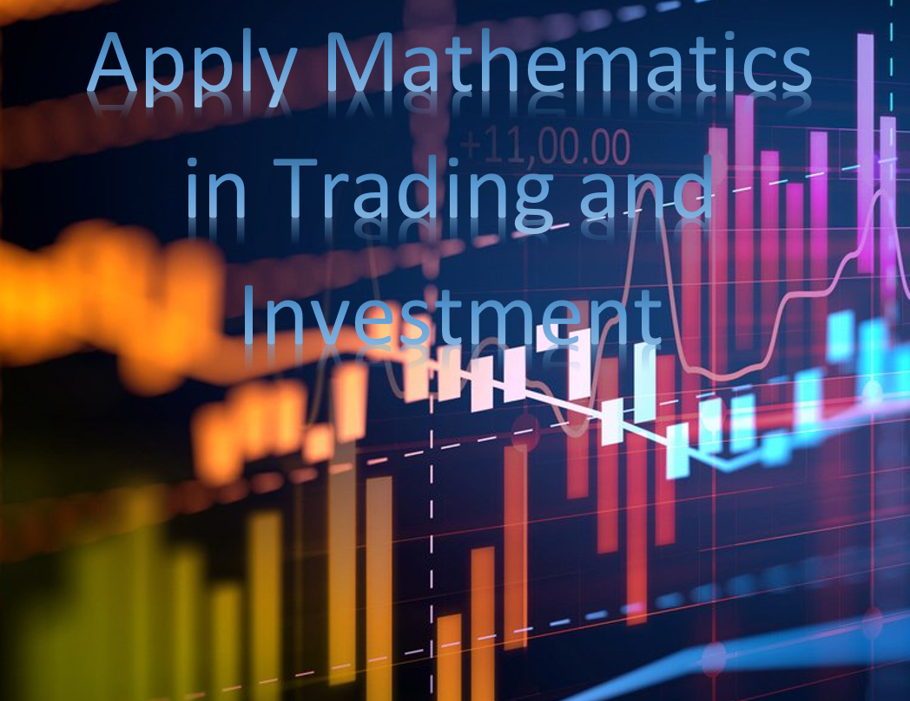

# Apply Mathematics in Trading and Investment

### Description:
Profitable trading is more about applying mathematics. Using mathematics for trading strategies.  
Statistics, Probability, Calculus, Linear Algebra, Optimization, Algorithms and Data Structures in trading and investment  
Econometric Models (Forecasting and studying statistical significance)   
Econophysics Models (Advance Research)  
Financial Engineering Models (Trading, Quantitative Analysis and Random Simulation)  
Asset Pricing Models (Risk-adjusted pricing, valuation and performance attribution analysis)  
Financial Risk Management Models (Hedging positions)  
Data Science/Mining Models - Neural Networks (Tensor Flow Machine Learning Software Application for forecasting stock prices)    
Operations Research Models (Portfolio Optimization)

### Math Explanation:  
Chebyshev distance is defined as maximum metric, or L∞ metric on a vector space where the greatest of difference between two vectors along any coordinate dimension.  

Covariance indicates the direction of the linear relationship between variables and values are standarized. Correlation measures both the strength and direction of the linear relationship between two variables and values are not standardize. Both covariance and correlation measure the relationship and the dependency between two variables.  

Derivative Linear Equation is derivative of a linear function y = mx + b can be derived using the definition of the derivative. The linear function derivative is a constant, and is equal to the slope of the linear function. Linear function derivatives are parts of many polynomial derivatives.   

Differential calculus is a techniques which deals with the rate of change of one quantity with respect to another. The rate of change of x with respect to y is expressed dx/dy. It is one of the major calculus concepts apart from integrals.  

Euclidean distance is a metrice between two points; as a result, the Euclidean distance between two points in the Euclidean space is defined as the length of the line segment between two points.  

Hamming distance is a metric for comparing two integers; therefore, two integers is the number of positions at which the corresponding bits are different.   

Information theory is the mathematical system  that overlaps into communications engineering, biology, medical science, sociology, and psychology.  In theory, it devoted to the discovery and exploration of mathematical laws that govern the behavior of data as it is transferred, stored, or retrieved.   

Intergal is a mathematical object that can be interpreted as an area or a generalization of area. Finding an Integral is the reverse of finding a Derivative. Other words for integral include antiderivative and primitive.  

LInear algebra is methametical about linear combination. It uses arithmetic on columns of numbers called vectors and arrays of numbers called matrices. Matrice creates new columns and arrays of numbers. Linear algebra is the study of lines and planes, vector spaces and mappings that are required for linear transforms.  

Mahalanobis distance is a metric for an effective multivariate distance to measures the distance between a point and a distribution.

Manhattan distance is a metric to calculated as the sum of the absolute differences between the two vectors. The Manhattan distance is related to the L1 vector norm and the sum absolute error and mean absolute error metric.  

Maximal Lyapunov Exponents determines a notion of predictability for a dynamical system. A positive MLE is usually taken as an indication that the system is chaotic (provided some other conditions are met, e.g., phase space compactness). While the zero value means that along the flow, there is no divergence between consecutive points on a trajectory.  

Minkowski metric is a metric in a normed vector space which can be considered as a generalization of both the Euclidean distance. The distance similarity measurement between two points in the normed vector space (N dimensional real space).   

Polynomial is defined as an expression which is composed of variables, constants and exponents, that are combined using mathematical operations such as addition, subtraction, multiplication and division.  Also, polynomial can have one or more terms, but not an infinite number of terms.  

Probability Information Theory is a mathematical framework for representing uncertain statements and measures of information of the distributions associated with random variables.    

Anscombe's Quartet is comprises a group of four data sets which are nearly identical in simple descriptive statistics, but they have different distributions and appear very different when graphed. Each dataset consists of eleven (x,y) points.   

Straight line is general equation of a straight line is y = mx + c, where m is the gradient, and y = c is the value where the line cuts the y-axis. This number c is called the intercept on the y-axis. The equation of a straight line with gradient m and intercept c on the y-axis is y = mx + c.  

## Author:    
### * Tin Hang  

## 🔴 Warning: This is not financial advisor.  Do not use this to invest or trade. It is for educational purpose.  

