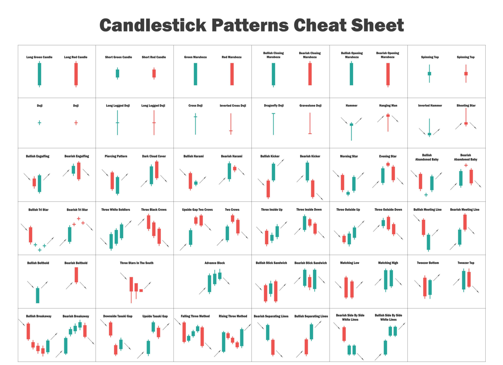

# Candlestick in Python

## Candlestick Libraries
https://github.com/matplotlib/mplfinance  
https://github.com/mrjbq7/ta-lib   

#### Import Libaries:
import mplfinance as mpf   
import talib  
from mplfinance.original_flavor import candlestick_ohlc  

### List of different types of candlesticks

This will help you find particular candlesticks in the historical data and in the chart.  

### Website Links:
https://school.stockcharts.com/doku.php?id=chart_analysis:introduction_to_candlesticks  
https://en.wikipedia.org/wiki/Candlestick_pattern  

### Books about Japnese Candlestick  
#### Japanese Candlestick Charting Techniques, Second Edition by Steve Nison 
    
#### Beyond Candlesticks: New Japanese Charting Techniques Revealed by Steve Nison  
  
#### The Candlestick Course 1st Edition by Steve Nison  
  

## Author  
### * Tin Hang  

## 🔴 Candlestick chart is accurate based on the prices: the open, low, high, and close prices.  However, candlestick pattern to predict future price is not very.  
## 🔴 Warning: This is not financial advisor.  Do not use this to invest or trade. It is for educational purpose.  
