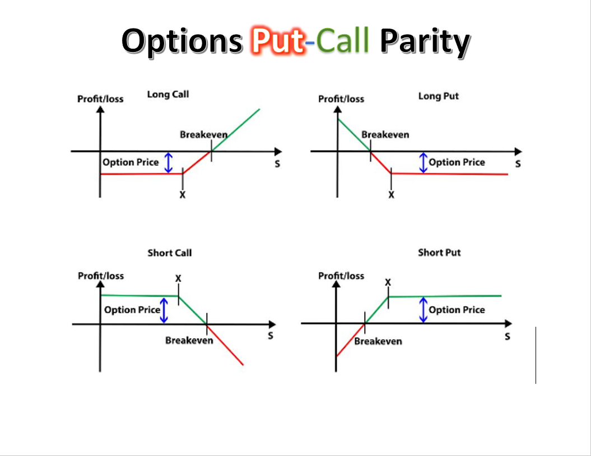

# Python for Options Trading and Investment

### List of different types of analyzing options and options strategies  
Options analysis is a method for investors use for to buy call and put; therefore, traders make decision in buying and selling. 

#### Call option gives the holder the right to buy a stock.  
#### Put opton gives the holder the right to sell a stock.   

"buy to open" - to buy long call or put options  
"sell to open" - options writing and collect premium because selling the rights of the option to another market participant 
"sell to close" - to close the position  
"buy to close" - buy the stock  

## Options Strategies  
1. Long Call
2. Long Put
3. Short Put
4. Covered Call  
5. Married Put  
6. Bull Call Spread  
7. Bear Put Spread  
8. Protective Collar  
9. Long Straddle  
10. Long Strangle  
11. Long Call Butterfly Spread  
12. Iron Condor  
13. Iron Butterfly  

:red_circle: Warning: This is not financial advisor.  Do not use this to invest or trade. It is for educational purpose.  

https://www.investopedia.com/trading/options-strategies/

## Author:    
### Tin Hang  

## References:  
https://www.investopedia.com/trading/options-strategies/  
https://www.optionsplaybook.com/option-strategies/  

