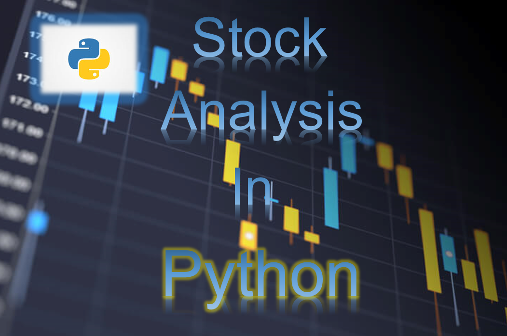

# Python for Stock Trading and Investment

### List of different types of analyzing stocks and trading strategies

Stock analysis is a method for investors to use (short or long term) and to make buying and selling decisions. By studying and evaluating the past and current historical data, fundamental data or news, investors and traders attempt to gain an winning edge in the markets by making the best decisions. :chart_with_upwards_trend: :chart_with_downwards_trend:  

Trading strategies is a method for investors and traders to develop a strategies that works for them to gain profits. On the other hand, traders need to find the right method or strategies that works for them. :bar_chart:  

### Download Software  
https://www.python.org/  

<h3 align="left"> Programming Language:</h3>

 </a>   

<h3 align="left">Tools:</h3>

 </a>      

## Author  
### * Tin Hang  

## 🔴 Warning: This is not financial advisor.  Do not use this to invest or trade. It is for educational purpose.  
