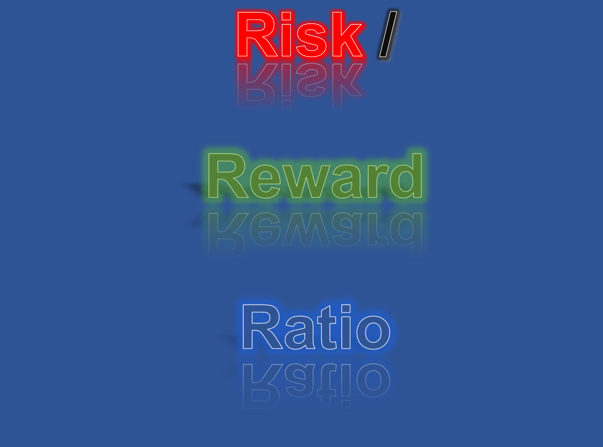

# Performance Measurement Metrics

## Description:  
### The performance measurement is similar to risk-return tradeoff. Risk-return states that higher risk with greater probability of higher return and lower risk with a greater probability of smaller return. Therefore, trade off which an investor faces between risk and return will considering investment decisions is called the risk return trade off.  

#### Standard Deviation is the most common measure of risk used in investment and trading. Standard deviation measures the variability of asset's returns.  

#### Beta is a measure of volatility and is similar to standard deviation; however, beta measures volatility in relation to the market as a whole. Beta is use for investment strategy that will tell you how volatile it is when compared to the broader market. A beta of 1 means that the strategy has the same volatility as the market. A beta of less than one indicates lower volatility than the market, while a beta greater one indicates higher volatility than the market.  For example, a higher Beta implies more risk, a lower Beta implies less risk.  

#### Maximum Drawdown is a metric with simple indicator of risk that is both intuitive and easy to understand. Maximum drawdown measures the greatest peak-to-trough decline that an investment strategy experiences over time. As a result, maximum drawdown is expressed as a percentage and reflects the largest price move down from a new high. For example, lower maximum drawdown implies less risk, higher maximum drawdown implies higher risk.  

# Common Risk and Returns Metrics  
Sharpe Ratio  
Sortino Ratio  
Treynor Ratio  

# List of Risk-Adjusted Returns Ratios Measurement for Risk-Reward Ratio Charts  

Appraisal Ratio  
Bernardo Ledoit Ratio  
Burke Ratio  
Modified Burket Ratio  
Calmar Ratio  
Conditional Sharpe Ratio  
Gain Loss Ratio  
Information Ratio  
Jensen's Alpha  
Kappa Three Ratio  
Ulcer Index (%) or Martin Ratio    
Modigliani Ratio  or M Squared  
Modified Sharpe Ratio  
Omega Ratio  
Pain Ratio  
Risk-adjusted return on capital (RAROC)  
Risk return Ratio  
Sterling Ratio  
STARR Ratio
Sharpe Ratio  
Sortino Ratio  
Stutzer Ratio  
Treynor Ratio   
Upside Potential Ratio  

## Author:    
### * Tin Hang  

## 🔴 Warning: This is not financial advisor.  Do not use this to invest or trade. It is for educational purpose.  

