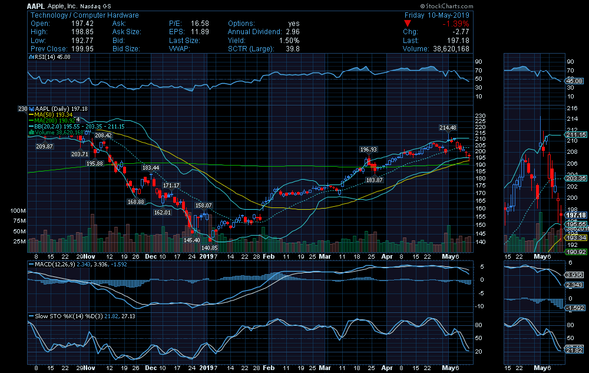

# Technical Analysis Indicators
### Description: Technical Analysis (TA) is a method to analyze securities prices and predict or forecast the price based on TA indicators. TA is used in investments and identify trading opportunities in price trends and patterns seen on charts.     

# List of Technial Analysis Indicators  

Accumulation Distribution Line (ADL)  
Average Directional Index (ADX)  
Average Directional Movement Rating (ADXR)  
Absolute Price Oscillator (APO)  
Average True Range (ATR)  
Absolute Return Indicator
Alligators Gator Oscillator  
Aroon  
Aroon Oscillator  
Bollinger BandWidth
B Indicator  
Balance of Power  
Beta Indicator  
Bollinger Bands  
Breadth Indicators 
Commodity Channel Index (CCI)    
Close Location Value (CLV)  
Chaikin Money Flow (CMF)  
Chaikin Oscillator  
Chandelier Exit  
Coppock Curve    
Correlation Coefficient  
Covariance  
Double Exponential Moving Average (DEMA)  
Dynamic Momentum Index (DMI)  
Detrended Price Oscillator (DPO)  
Dochain Channel  
Exponential Moving Average (EMA)  
Exponential Moving Averag Volume (EMAV)    
Exponential Weighted Moving Average (EWMA)    
Exponential Weighted Moving Average - Double  
Exponential Weighted Moving Average - Triple   
Ease of Movement  
Efficiency Ratio  
Elder Force Index  
Elder Ray Index  
Force Index  
GANN Lines Angles  
Guppy Multiple Moving Average (GMMA)  
Geometric Return Indicator  
Heiken Ashi  
High Minus Low 
Hull Moving Average  
Ichimoku  
Inverse Fisher Transform  
Kaufman's Adaptive Moving Average (KAMA)  
Know Sure Thing (KST)  
Keltners Channels  
Kijun-Sen    
Linear Regression  
Linear Regression Slope  
Linear Weighted Moving Average  
Logarithmic Return Indicator  
Moving Average Convergence Divergence (MACD)  
Mean Absolute Deviation (MAD) Indicator  
Moving Average High Low  
Money Flow Index indicator (MFI)  
Martin Pring Speical K 
Maximum Price  
McClellan Oscillator  
Median Price  
Minimum Price  
Momentum  
Momentum 2  
Moving Average Envelopes
Moving Average High Low  
Moving Average Ribbon  
Moving Correlation Coefficient  
Moving Covariance  
Moving Dispersion  
Moving Linear Regression  
Moving Maximum  
Moving Median  
Moving Minimum  
Moving Standard Deviation  
Moving Standard Error    
Moving Summation  
Normalized Average True Range (NATR)  
Negative Volume Index (NVI)  
Negative Volume Index (NVI) 2  
New Highs New Lows 
Pretty Good Oscillator (PGO)  
Decision Point Price Momentum Oscillator (PMO)  
Positive Volume Index (PVI)  
Price Volume Trend (PVT)  
Pivot Points  
Price Channels  
Price Relative  
Qstick  
Rate-of-Change (ROC)  
Rate-of-Change (ROC) 2  
Rate of Change (ROC100)  
Rate of Change Percentage (ROCP)  
Rate of Change Rate (ROCR)  
Return on Investment (ROI)  
Relative Strength Index (RSI)  
Relative Strength Index 2 (RSI2)  
Relative Strength Index & Bollinger Bands  
Rainbow Charts  
Realised Volatility  
Relative Volatility Index  
Simple Moving Average (SMA)  
Smoothed Moving Average (SMMA)  
Smoothed Moving Average
Speed Resistance Lines (SRL)   
Standard Deviation Volatility  
Stochastic Fast  
Stochastic Full  
Stochastic RSI  
Stochastic Slow  
Super Trend  
T3 Moving Average  
Triple Exponential Moving Average (TEMA)  
Triangular Moving Average (TRIMA)  
TRIX indicator (TRIX)  
Time Weighted Average Price (TWAP)  
Tenkan-Sen      
Tirone Levels 
True Strength Index  
Typical Price  
Ulcer Index  
Ultimate Oscillator  
Volume Accumulation Oscillator (VAO)  
Volume Price Trend (VPT)  
Volume Weighted Average Price (VWAP)  
Variance  
Volume Price Confirmation Indicator (VPCI)  
Volume Weighted Moving Average (VWMA)  
Vortex Indicator  
Weighted Moving Average (WMA)  
Wilder's Smoothing Moving Average (WSMA)  
Welles Wilder’s Smoothing Average (WWS)  
William %R  
Z-Score Indicator  
Zero Lag Exponential Moving Average (ZLEMA)  
ZigZag  

## Will Add more indicators

## I hope you enjoy learning about stock indicators.

## Author:  
### * Tin Hang  

## References
https://www.investopedia.com/  
https://stockcharts.com/school/doku.php?id=chart_school:technical_indicators  
https://www.tradingtechnologies.com/xtrader-help/x-study/technical-indicator-definitions/list-of-technical-indicators/  
https://library.tradingtechnologies.com/trade/chrt-technical-indicators.html  
https://www.metatrader4.com/en/trading-platform/help/analytics/tech_indicators  
https://www.incrediblecharts.com/indicators/momentum_indicators.php  
https://www.fmlabs.com/reference/default.htm  
https://www.barchart.com/education/technical-indicators/mcginley_dynamic  
https://www.danielstrading.com/education/technical-analysis-learning-center  
https://www.marketvolume.com/technicalanalysis/  

