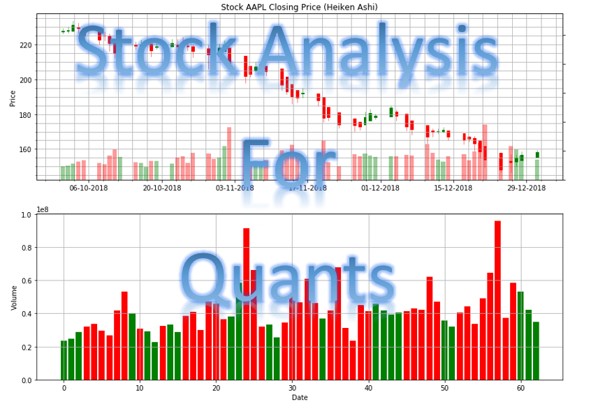

# Stock Analysis for Quants  
This is Stock Analysis project in Excel, Power BI, Matlab, Python, and R language with different types of analysis such as data analysis, technical analysis, fundamental analysis, quantitative analysis, and different types of trading strategies. In addition, this is for quantitative reaserching and analyzing in trading and investment. Quantitative analysis (QA) is a technique that use mathematices and statistical modeling, measurement, and research for understanding finacial behaviors. Many different types of technical indicators and stock strategies in Excel, Python, and R language. Using timeseries, forecasting, machine learning, and deep learning for this research project in different type of programming languages. :chart_with_upwards_trend: :chart_with_downwards_trend:

# Prerequistes
Python 3.5+    

R 3.0.0 +  

Matlab R2016a    

Excel 2016   

Power BI  

# List of Trading Strategies  
## Description: There  are many various methods used to accomplish different strategy;therefore, each with appropriate market environments and risks inherent in the strategy. Trading strategy is the method of buying and selling in markets that is based on predefined rules used to make trading decisions.  
Trend-following Strategies  
Algorithmic Trading Strategies  
Statistical Arbitrage  
Arbitrage Opportunities  
Index Fund Rebalancing  
Mathematical Model-based Strategies  
Trading Range (Mean Reversion)  
Fundamental Analysis  
Technical Analysis  
Swing Trading Strategy
Scalping (Trading)  
Day Trading    
Trading the News  
Trading the Signals 
Social Trading   
Value Investing  
Performance Analysis  
Quantitative Analysis  

# List of Portfolio Strategies  
Long-term Investment  
Short-term Investment  
Buy and Hold  
Rebalance Portfolio  
Value Investment  
Momentum Investment  
Core and Satellite  
The Dave Ramsey Portfolio  
Capital Asset Pricing Model (CAPM)  
Modern Portfolio Theory (MPT)  
Post-Modern Portfolio Theory (PMPT)  
Portfolio Allocation    
Portfolio Optimization    
Markowitz Portfolio Optimization Theory 
Minimum-Variance Portfolios (Global Minimum-variance Portfolio)  
Global Portfolio Optimization (The Black Litterman)    
Tactical Asset Allocation  
Constant-Weighting Asset Allocation  
Strategic Asset Allocation  
Dynamic Asset Allocation  
Insured Asset Allocation  
Integrated Asset Allocation  
ETFs Asset Allocation  
Bonds Asset Allocation  
Mutual Funds Asset Allocation  
Commodities Asset Allocation   
Portfolio Insurance  
Constant Proportion Portfolio Insurance (CPPI)   
Presidental Stock Portfolio  
Obama Stock Portfolio  
Trump Stock Portfolio  

# List Type of Risks  
## Description: Risk measures are statistical method to defined the individual stock or toegether to perform a resk assessment.  
Trade Risk  
Position Size Risk    
Market Risk  
Margin Risk  
Liquidity Risk  
Overnight Risk  
Volatility Risk  

# List of Risk-Adjusted Returns Ratios Measurement   
Appraisal Ratio  
Bernardo Ledoit Ratio  
Burke Ratio  
Calmar Ratio  
Conditional Sharpe Ratio  
Gain Loss Ratio  
Information Ratio  
Kappa Three Ratio  
Martin Ratio  
Modigliani Ratio  
Omega Ratio  
Pain Ratio  
Sterling Ratio  
Sharpe Ratio  
Sortino Ratio  
Treynor Ratio   
Upside Potential Ratio  

## Author  
### * Tin Hang

## Disclaimer
&#x1F53B; Do not use this code for investing or trading in the stock market. However, if you are interest in the stock market, you should read :books: books, research paper, and :computer: blog that relate to stock market, investment, or finance. On the other hand, if you into quant, machine learning or deep learning, read books about &#x1F4D8; machine trading, algorithmic trading, and quantitative trading. Learn from it and take notes :notebook:.

## This is not get rich quick.
## This is not financial advisor. 
## This is for researching and educational purposes.
