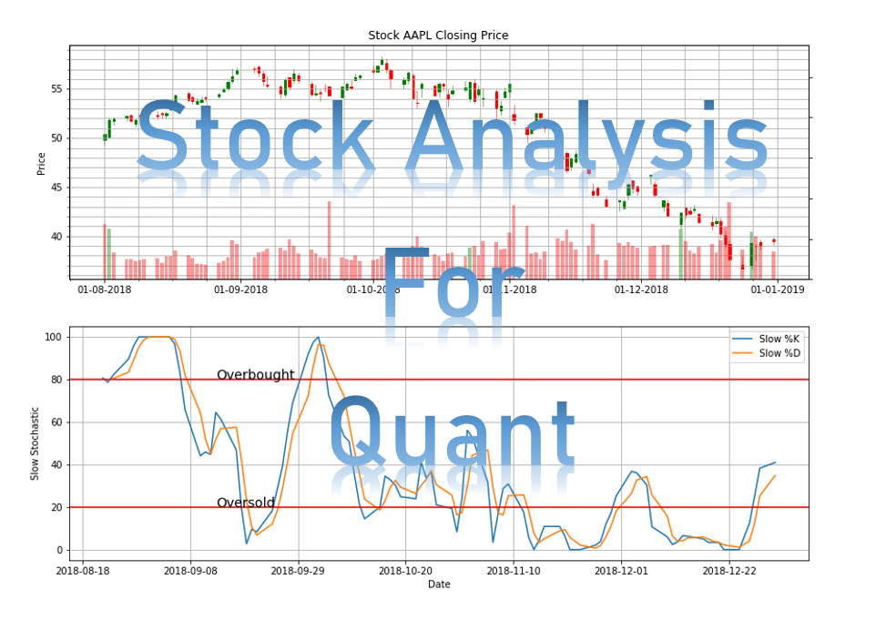

[![Contributors][contributors-shield]][contributors-url]
[![Forks][forks-shield]][forks-url]
[![Stargazers][stars-shield]][stars-url]
[![Issues][issues-shield]][issues-url]
[![MIT License][license-shield]][license-url]
[![LinkedIn][linkedin-shield]][linkedin-url]

### Ready to support my work? Click the button below to buy me a coffee.

<!-- MARKDOWN LINKS & IMAGES -->
<!-- https://www.markdownguide.org/basic-syntax/#reference-style-links -->
[contributors-shield]: https://img.shields.io/github/contributors/LastAncientOne/Stock_Analysis_For_Quant.svg?style=for-the-badge
[contributors-url]: https://github.com/LastAncientOne/Stock_Analysis_For_Quant/graphs/contributors
[forks-shield]: https://img.shields.io/github/forks/LastAncientOne/Stock_Analysis_For_Quant.svg?style=for-the-badge
[forks-url]: https://github.com/LastAncientOne/Stock_Analysis_For_Quant/network/members
[stars-shield]: https://img.shields.io/github/stars/LastAncientOne/Stock_Analysis_For_Quant.svg?style=for-the-badge
[stars-url]: https://github.com/LastAncientOne/Stock_Analysis_For_Quant/stargazers
[issues-shield]: https://img.shields.io/github/issues/LastAncientOne/Stock_Analysis_For_Quant.svg?style=for-the-badge
[issues-url]: https://github.com/LastAncientOne/Stock_Analysis_For_Quant/issues
[license-shield]: https://img.shields.io/github/license/LastAncientOne/Stock_Analysis_For_Quant.svg?style=for-the-badge
[license-url]: LICENSE
[linkedin-shield]: https://img.shields.io/badge/-LinkedIn-black.svg?style=for-the-badge&logo=linkedin&colorB=555
[linkedin-url]: https://linkedin.com/in/tin-hang

<h1 align="center">Stock Analysis For Quant</h1>

| Programming Language and Software | Github Links |
| :--- | :--- |
| Stock Analysis in Excel | [Excel](https://github.com/LastAncientOne/Stock_Analysis_For_Quant/tree/master/Excel_Stock)|
| Stock Analysis in Matlab | [Matlab](https://github.com/LastAncientOne/Stock_Analysis_For_Quant/tree/master/Matlab_Stock)|
| Stock Analysis in Power BI | [Power BI](https://github.com/LastAncientOne/Stock_Analysis_For_Quant/tree/master/PowerBI_Stock)|
| Stock Analysis in Python | [Python](https://github.com/LastAncientOne/Stock_Analysis_For_Quant/tree/master/Python_Stock)|
| Stock Analysis in R | [R](https://github.com/LastAncientOne/Stock_Analysis_For_Quant/tree/master/R_Stock)|
| Stock Analysis in Tableau | [Tableau](https://github.com/LastAncientOne/Stock_Analysis_For_Quant/tree/master/Tableau_Stock)|

### Description:  
#### This comprehensive Stock Analysis project utilizes an extensive range of programming languages, including Excel, Tableau, Power BI, Matlab, Python, R, and Tableau. It covers various analytical methodologies such as data analysis, technical analysis, fundamental analysis, and quantitative analysis. Additionally, it involves identifying candlestick patterns and crafting diverse trading strategies. The project encompasses stocks, options, bonds, mutual funds, and Exchange-traded funds (ETFs), with a primary focus on quantitative research in trading and investment. It harnesses mathematical tools, statistical models, and research methodologies to gain profound insights into financial behaviors. Moreover, it integrates technical indicators and trading strategies across multiple languages, employing techniques such as time series analysis, forecasting, and machine learning, including deep learning methods. :chart_with_upwards_trend: :chart_with_downwards_trend:   

### What is stock market?  
#### The stock market, also known as the equity market, is primarily recognized for the trading of stocks or equities, along with other financial securities like exchange-traded funds (ETFs), corporate bonds, and derivatives based on stocks, commodities, currencies, and bonds.  

### What is U.S. stock and non U.S. stock?  
#### U.S. equities refer to companies that trade on the U.S. stock exchange, whereas non-U.S. equities are those whose shares are listed on a U.S. exchange in addition to their primary listing on another stock exchange. Consequently, many international companies choose to have their stocks traded on a U.S. stock exchange. For example, when a foreign company decides to list its stock on a U.S. exchange, it must determine whether to be classified as a "foreign private issuer" under U.S. securities laws. However, foreign private issuers are subject to distinct reporting and regulatory obligations compared to U.S. companies.  

### What is stocks?  
#### A stocks is an investment that represent a share or partial ownership of a company. First, a private company first sells shares of stock to the public, this process is known as an initial public offering (IPO). A public company is a corporation whose ownership is distributed amongst general public shareholders through publicly-traded stock shares. Investors buy stocks to earn a return on their investment. Stocks are one of the best way to build up capital or wealth. Stock is a low and high risk investment.   

### What is bonds?  
#### Bonds is a fixed income instrument that represents a loan made by an investor to a borrower such as corporate or governmental.  Owner of bonds are the debt holders, or creditors of the issuer. Bonds are tax-free, secured, redeemable and non-convertible in nature.  

### What is real estates?  
#### Real estate is considered to be its own asset class and one that should be at least a part of a well-diversified portfolio. Real estate investment is a financial strategy that uses the management, ownership, purchase, rental, and/or sale of property for profit.   

### What is private equity?
#### Private equity is investment that is organized as limited partnerships. It can buy and restructure companies that are not publicly traded. Private equity is consists of capital that is not listed on a public exchange. Private equity is composed of funds and investors that directly invest in private companies, or that engage in buyouts of public companies, resulting in the delisting of public equity. Invest in private equity is direct investment and seek out a private equity firm to investment with them.  Invest in exchange-traded funds, or ETFs because they are built to track the performance of private equity firms.     

### What is fixed income?
#### Fixed income is an investment approach focused on preservation of capital and income. Fixed income includes investments like government and corporate bonds, CDs and money market funds. Fixed income can offer a steady stream of income with less risk than stocks.   

### What is Government-Sponsored Enterprise (GSE)?  
#### Government-Sponsored Enterprise (GSE) is a financial services corporation created by the United States Congress. These entities are designed to enhance the flow of credit to specific sectors of the economy while operating under government oversight. GSEs typically have a public mandate to serve some public policy goal, such as increasing access to home ownership or facilitating agricultural lending.  

### What is global equity fund?
#### A global equity fund is sub-category of funds on the stock funds side of the ledger. A global equity fund has the latitude to buy shares of companies from any country including the United States. Global equity fund will keep a certain portion of its assets invested in U.S. stocks and the balance invested in international stocks.  

### What is inflation-indexed securities?
#### Inflation-indexed securities guarantee a return that's greater than inflation or a return higher than the rate of inflation if it is held to maturity. The inflation-indexed security helps protect an investor's returns from the erosion of inflation, guaranteeing a real return. There are many different types of inflation-indexed assets such as Consumer Price Index (CPI), inflation-indexed bonds, and Treasury Inflation-Protected Securities.  

### What is options?  
#### Options is a contract to buy or sell a specific financial product known as the option's underlying instrument or underlying interest.  Also, options are contracts that gives the owner, the holder, the right, but not the obligation, to buy or sell an underlying asset or instrument at a specified strike price prior to or on a specified date, depending on the form of the option. Options is a high risk investment.  

### What is Index fund?  
#### An index fund is a mutual fund or exchange-traded fund that is made up of stocks or companies' performance and the performance of a market index such as the S&P 500. Index funds are funds that can track specified information based on underlying investments and are passively managed with lower fees than actively managed funds because they often generate higher investment returns and well-diversified investments. The S&P 500 Index, the Russell 2000 Index, and the Wilshire 5000 Total Market Index are just a few examples of market indexes that index funds may seek to track.  

### What is market index?  
#### The market index tracks the ups and downs of a chosen group of stocks or other assets to see the health of the stock market because it guides financial firms in the creation of index funds and exchange-traded funds (ETFs), and helps investors gauge the performance of their investments. A market index measures the performance of a “basket” of securities (like stocks or bonds), which is meant to represent a sector of a stock market, or of an economy. Investors cannot invest directly in a market index, but because index funds track a market index, they provide an indirect investment option.  

### What is Exchange Traded Funds (ETF)?
#### Exchange Traded Funds (ETF) is a type of investment fund and exchange-traded product. ETFs are traded on stock exchanges. Also, they are similar in many ways to mutual funds, except that ETFs are bought and sold throughout the day on stock exchanges.  

### What is Mutual Funds?
#### Mutual Funds are investment strategies that allow investor to pool their money together with other investors to purchase a collection of stocks, bonds, or other securities that might be difficult to recreate on their own.  Mutual funds are a low risk investment.    

### What is Hedge Funds?  
#### Hedge Funds are investment that use pooled funds and are gathered from many high-net-worth individuals. In addition, Hedge funds are more expensive compared to conventional investment funds. They are aggressively managed with aid of the fund manager because they are used in both domestic and international markets, with the aim of generating high returns.  It is important to note that hedge funds are generally only accessible to accredited investors as they require less Securities and Exchange Commission (SEC) regulations than other funds.  

### What is risk?  
#### All investments have some degree of risk. In finance, risk refers to the degree of uncertainty and/or potential financial loss inherent in an investment decision.  There are many different types of risk such as business risk, volatility risk, inflation risk, interest rate risk, and liquidity risk.  

### What is trading strategies?
####  Trading strategies are methods that investors and traders use to develop approaches tailored to their needs, allowing them to generate profits. Conversely, traders must find the appropriate methods or strategies that suit them. To ensure effectiveness, traders need to test their strategies through backtesting. However, it is important to note that strategies may not perform as effectively during live trading when compared to testing on historical data. :bar_chart:  

### What is Quantitative research?
#### Quantitative research is the process of collecting and analyzing numerical data to find patterns and averages, make predictions, test causal relationships, and generalize results to wider populations. Also, quantitative research deals with numbers and statistics. Quantitative research can have expressed in numbers and graphs. It is used to test or confirm theories and assumptions.  

### What is Qualitative research?
#### Qualitative research is expressed in words such as interviews with open-ended questions, observations described in words, and literature reviews that explore concepts and theories. The qualitative research is used to understand concepts, thoughts or experiences. Therefore, this type of research enables you to gather in-depth insights on topics that are not well understood.  

# Prerequistes
### Programming Language and Software  
Python 3.5+    

R 3.0.0 +  

Matlab R2016a    

Excel 2016 Or Newer Version 

Power BI   

Tableau  

### Download Software  
https://www.python.org/  
https://www.r-project.org/  
https://www.mathworks.com/?s_tid=gn_logo  
https://www.microsoft.com/en-us/microsoft-365/excel  
https://powerbi.microsoft.com/en-us/downloads/  
https://www.tableau.com/products/desktop/download  

<h3 align="left">Languages and Tools:</h3>

 </a>             

# List of Trading Strategies  
#### Description: There are various methods used to achieve different trading strategies, each suitable for specific market environments and carrying inherent risks. A trading strategy is a technique for buying and selling in the markets, relying on predefined rules to guide trading decisions.  
:large_blue_diamond:  
Trend-following Strategies  
Algorithmic Trading Strategies  
Statistical Arbitrage  
Arbitrage Opportunities  
Index Fund Rebalancing  
Mathematical Model-based Strategies  
Trading Range (Mean Reversion)  
Fundamental Analysis  
Technical Analysis  
Swing Trading Strategy
Scalping (Trading)  
Day Trading    
End-of-day trading strategy  
Trading the News  
Trading the Signals 
Social Trading   
Value Investing  
Performance Analysis  
Quantitative Analysis  

# List of Portfolio Strategies or Investment Strategies  
#### Description: Portfolio strategies are investment methods for investors to utilize their assets in order to achieve their financial goals. They represent a plan that assists in generating optimal investment returns.   
:large_blue_diamond:  
Arbitrage Pricing Theory (APT)  
Long-term Investment  
Short-term Investment  
Sustainable Investment  
All Weather Strategies  
Buy and Hold  
Defensive Stock Investing strategy  
Rebalance Portfolio  
Value Investment  
Momentum Investment  
Core and Satellite  
The Dave Ramsey Portfolio  
Capital Asset Pricing Model (CAPM)  
Modern Portfolio Theory (MPT)  
Post-Modern Portfolio Theory (PMPT)  
Portfolio Allocation    
Portfolio Optimization    
Markowitz Portfolio Optimization Theory (1952)  
Minimum-Variance Portfolios (Global Minimum-variance Portfolio)  
Global Portfolio Optimization (The Black Litterman)    
Tactical Asset Allocation  
Constant-Weighting Asset Allocation  
Strategic Asset Allocation  
Dynamic Asset Allocation  
Insured Asset Allocation  
Integrated Asset Allocation  
ETFs Asset Allocation  
Bonds Asset Allocation  
Mutual Funds Asset Allocation  
Commodities Asset Allocation   
Portfolio Insurance  
Constant Proportion Portfolio Insurance (CPPI)   
Presidental Stock Portfolio  
Obama Stock Portfolio  
Trump Stock Portfolio  

# List Type of Risks  
#### Description: Risk measures are statistical methods used to define the risk associated with individual stocks or portfolios. Risk is a measurement of potential portfolio loss and is influenced by various risk factors that determine the level of risk exposure. The most common types of market risk include interest rate risk, equity risk, commodity risk, and currency risk.  
:large_blue_diamond:  
Commodity Risk  
Currency Risk  
Equity Risk  
Trade Risk  
Position Size Risk   
Systematic Risk  
Market Risk  
Margin Risk  
Liquidity Risk  
Idiosyncratic Risk  
Interest Rate Risk  
Overnight Risk  
Volatility Risk  

# List of Risk-Adjusted Returns Ratios Measurement   
#### Description: Risk-Adjusted Return Ratios measure an investment's return in relation to the level of risk associated with it. The rate of return (ROR) represents the percentage change in the value of an investment. It is important to note that risk and the required rate of return are directly correlated. As risk increases, the required rate of return also increases, and conversely, as risk decreases, the required rate of return decreases.
:large_blue_diamond:  
Appraisal Ratio  
Bernardo Ledoit Ratio  
Burke Ratio  
Calmar Ratio  
Conditional Sharpe Ratio  
Gain Loss Ratio  
Information Ratio  
K appa Three Ratio  
Martin Ratio  
Modigliani Ratio  
Omega Ratio  
Pain Ratio  
Risk-adjusted return on capital (RAROC)  
Sterling Ratio  
Sharpe Ratio  
Sortino Ratio  
Treynor Ratio   
Upside Potential Ratio  

# List of Options Strategies     
#### Description: Options are contracts that give the buyer the right to buy or sell a specific amount of an underlying asset at a predetermined price before the contract expires. Options strategies involve the simultaneous buying or selling of one or more options, which may differ in various variables.  

:large_blue_diamond:  
Long Call  
Long Put  
Short Call  
Short Put  
Covered Call  
Married Put  
Bull Call Spread  
Bear Call Spread  
Bull Put Spread  
Bear Put Spread  
Call Backspread  
Long Straddle   
Short Straddle  
Long Strangle  
Short Strangle  
Iron Condor  
Iron Butterfly  
Long Calendar Spread with Calls  
Long Calendar Spread with Put  
Long Butterfly with Calls  
Long Butterfly with Put  
Protective Collar

# List of Asset Classes for Protection Against Inflation    
#### Description: Inflation is the increase in prices, resulting in a decline in purchasing power over time. It is measured by the average price level of a basket of goods and services in an economy, indicating price increases over a specified period. Therefore, it is crucial to identify suitable strategies and investments to hedge against inflation, as a given amount of currency will have reduced buying power compared to before.  
#### List of investing against inflation:  
:large_blue_diamond:   
Gold  
commodities  
60/40 Stock/Bond Portoflio  
Real Estate Investment Trusts (REITs)   
S&P 500    
Real Estate Income   
Bloomberg Aggregate Bond Index   
Leveraged Loans   
Treasury inflation-protected securities (TIPS)  

## Hey there! ☕️ Have you been finding value in learning about "Stock Analysis for Quant"? If you've been enjoying the journey and gaining insights from my content, I'd truly appreciate your support! By buying me a coffee, you're not only showing your appreciation but also fueling future content creation and learning opportunities for both of us. Your contribution goes a long way in helping me continue to provide quality insights and resources. Thank you for being a part of this community and for considering supporting my work! Let's keep learning and growing together." 🚀  

## Credits:
### Developed by Tin Hang and other contributors (sharing knowledge) from schools, books, and blogs.
### Creators who creates programming libraries for people to use.  

### Links to research paper for quant:  
https://www.researchgate.net (European Social networking site for scientists and researchers to share papers)  
https://www.academia.edu/ (Academics and Researchers to share educational papers from all over the worlds)  
https://quant.stackexchange.com/questions/38886/what-are-the-quantitative-finance-papers-that-we-should-all-have-in-our-shelves (Financial Research Papers)  
https://capital.com/financial-dictionary (Financial terms)  
http://www.performance-metrics.eu/performance_glossary.php (Performance Metrics)  
http://morningstardirect.morningstar.com/clientcomm/customcalculations.pdf (Financial Calculations)   
https://www.optionstrading.org/strategies/a-z-list/ (Options Trading Strategies)  

# :warning: Disclaimer & Warning
#### None of my content is meant to be construed as investment advice; it's for educational purposes only. Please do not use this code for investing or trading in the stock market or any real trading activities. All of my content consists strictly of personal opinions. It is important to conduct your own research and never solely rely on one person's opinion for financial guidance. Remember that there are multiple strategies available, and not all strategies may be suitable for everyone. Therefore, my content should NOT be considered as financial advice. When selecting stocks, ETFs, options, or cryptocurrencies to invest in, you should perform your own research. Additionally, if you are interested in the stock market, I recommend reading :books: books, research papers, and :computer: blogs related to the stock market, investment, or finance. On the other hand, if you are interested in quantitative analysis, I suggest reading books on machine learning or deep learning, as well as books on machine trading, algorithmic trading, and quantitative trading. It can be beneficial to experiment with historical stock prices and test different strategies or methods to determine their effectiveness. Learn from these experiments and make sure to take notes :notebook:.

## 🔴 This is not get rich quick.  
## 🔴 This is not financial advisor.   
## 🔴 This is for research and educational purposes.
