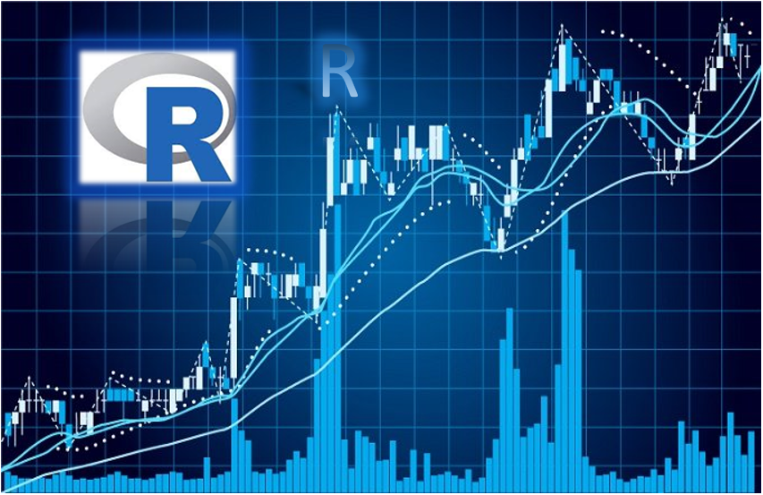

# R for Stock Trading and Investment  
### Description:
Stock analysis in R is a method for investors use (short or long term) and traders to make buying and selling decisions. By studying and evaluating past and current historical data, fundamental data or news, investors and traders attempt to gain an winning edge in the markets by making the best decisions. :chart_with_upwards_trend: :chart_with_downwards_trend:  

Trading strategies is a method for investors and traders to develop a strategies that works for them to gain profits. On the other hand, traders need to find the right method or strategies that works for them. :bar_chart:  
## Author  
### * Tin Hang  
