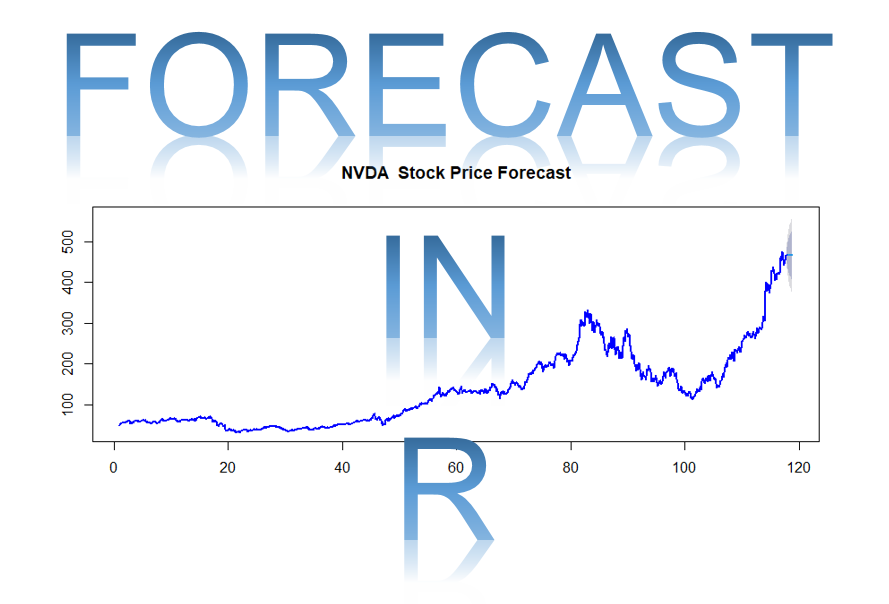

  

# Forecast in R  

### Description:  
#### Forecasting is the process of making predictions or estimates about future events or conditions based on past and present data, trends, and patterns. It involves analyzing historical information to identify regularities or trends and using that information to project future outcomes. There are various methods used in forecasting, ranging from simple extrapolation of historical data to complex statistical models and machine learning algorithms. These methods can be quantitative, involving numerical data and mathematical models, or qualitative, relying on expert judgment and subjective assessments. Forecasting is widely used in various fields such as finance, economics, weather prediction, supply chain management, and business planning. It helps businesses make informed decisions, allocate resources effectively, manage risks, and anticipate changes in market conditions. Accuracy in forecasting depends on the quality of available data, the appropriateness of the forecasting technique used, and the uncertainty inherent in predicting future events. While it cannot provide perfect predictions, it helps in making more informed decisions and plans for the future.  

### Forecast Libraries:  
forecast https://github.com/robjhyndman/forecast/    
smooth https://github.com/cran/smooth/  
stats https://cran.r-project.org/web/packages/STAT/index.html   
tsa https://cran.r-project.org/web/packages/TSA/index.html  
prophet https://github.com/facebook/prophet  

## Author:  
### * Tin Hang  
## 🔴 Warning: This is not financial advice. Do not rely on it for investment or trading decisions. It is for educational purposes only.   
