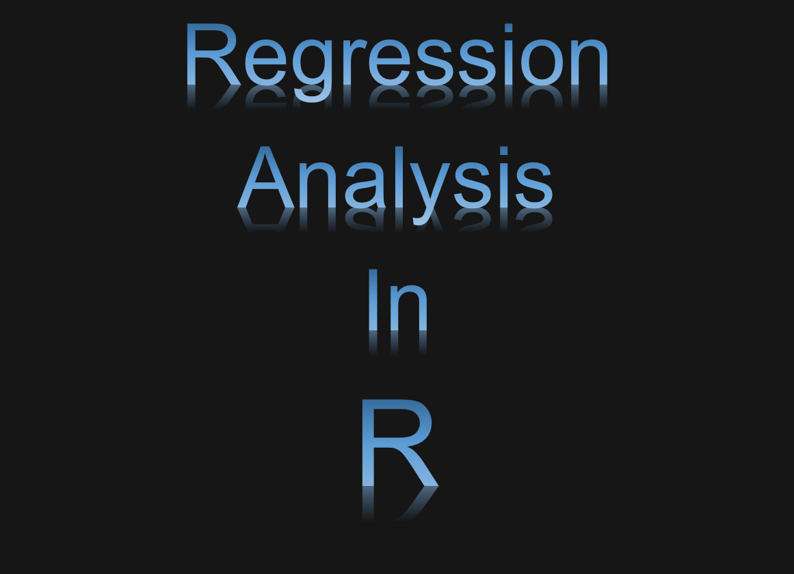

# Regression in R  

### Description:  
#### Regression Analysis is a statistical method that explore the relationship between two or more variables. There many different types of regression analysis; however, they all have one or more independent variables on a dependent variable.  

### MSE, MAE, RMSE, and R-Squared metrics are mainly used to evaluate the prediction error rates and model performance in regression analysis.  
| MSE / RSME | MAE| R2| 
| ----------------------- | ------------- | -------------| 
| Based on square of error      | Based on absolute value of error | Based on correlation between actual and predicted value|
| Value lies between 0 to infinity | Value lies between 0 to infinity  | Value lies between 0 and 1 |
| Sensitive to outliers, punishes larger error more | Treat larger and small errors equally. Not sensitive to outliers | Not sensitive to outliers |
| Small value indicates better model | Small value indicates better model | Value near 1 indicates better model |

### Mean Squared Error (MSE)  
Mean Square Error (MSE) is a mean or average of the square of the difference between actual and estimated values.    
#### Equations:  
  

MSE = mean squared error  
n = number of data points  
y_i = observed vales  
y ̂_i = predicted values  

### Root Mean Squared Error (RMSE)
Root Mean Square Error (MSE) is the residual (difference between prediction and truth) for each data point, compute the norm of residual for each data point, compute the mean of residuals and take the square root of that mean.  
#### Equations:  

RMSE = root-mean-squared error  
i = variable i   
n = number of non-missing data points  
x_i = actual observations time series  
x ̂_i = estimated time series  

### Mean Absolute Error (MAE)  
Mean Absolute Error (MAE) is a method to find the sum of the absolute difference between actual and predicted values.  
Equations:  
  

MAE = mean absolute error  
n = total number of data points  
x_i = prediction  
y_i = true value  

### R Squared (R2)  
R2 or R Squared is a coefficient of determination and it is the total variance calculated by model/total variance.  

#### Equations:  
  

  
  

R^2 = coefficient of determination  
RSS = sum of squares of residuals  
TSS = total sum of squares   

### Linear Regression  
Linear Regression is a linear model or linear regression algorithm, and mostly common used. The linear relationship between the input variables (x) and the single output variable (y). 
Use this model to predict numerical such as continuous and discrete data.  

(1) Simple Linear Regression – Single input variable (x)  
(2) Multiple Linear Regression – Multiple input variables (x)  

#### Equations:  
#### Linear Regression Equation  
   
  

#### Mulitple Linear Regression Equation  
   

#### Polynomial Linear Regression Equation  
  

### Logistic Regression
Logistic Regression is a predictive modelling algorithm.  Use this model to predict the class or category.  

#### Equations: 
   

### Decision Tree
Decision Tree is algorithm that decide to split a node into two or more sub-nodes and is a diagram or chart that helps determine the course of action or show a statistical probability.     
Use this model to predict numerical such as class and category or continuous and discrete data.  
(1)	Categorical Variable Decision Tree – Class or Category data  
(2)	Continuous Variable Decision Tree – Continuous or Discrete data  

### Information Theory    
Information theory studies the quantification of information, its storage, and communication. There are two concepts that are used to construct a decision tree using ID3 algorithm is called information entropy and information gain.    
### Information Entropy  
Information Entropy is a measurement of the smallest amount of information to represent a data item from that data.  
### Information Gain  
Information Gain is calculated for a split by subtracting the weighted entropies of each branch from the original entropy. When training a Decision Tree using these metrics, the best split is chosen by maximizing Information Gain.  

#### Equations:  
  

  

### Bayesian Linear Regression  
Bayesian Linear Regression is algorithm that uses probability distributions rather than point estimates. Use the model to predict the continuous or category. 

#### Equations:  

  

### Elastic Net Regression
Ordinal Logistic Regression is algorithm uses a weighted combination of L1 and L2 regularization. Use this model to predict continuous data. 

#### Equations:  

  

### Quantile Regression  
Ordinal Logistic Regression is algorithm and is used for finding the relationships between variables outside of the mean of the data.  Also, it is useful in understanding outcomes that are non-normally distributed and that have nonlinear relationships with predictor variables. Use this model to predict continuous or classification data.  

#### Equations:    

  

### Ordinal Regression  
Ordinal Logistic Regression is a method to use interactions between independent variables to predict the dependent variable.  
Use this model to predict an ordinal dependent variable given one or more independent variables.  

#### Equations:  

### Random Forest Regression  
Random Forest Regression is algorithm that performed both classification and regression tasks with the use of multiple decision trees. The technique is called Bootstrap and Aggregation, commonly known as bagging.  
Use this model to predict continuous or categorical data.  

### Ridge Regression  
Ridge Regression is algorithm that used to analyses any data that suffers from multicollinearity and it performs L2 regularization. If the multicollinearity occurs in the model, least-squares are unbiased, and variances are large. Therefore, results in predicted values to be far away from the actual values. Use this model to predict continuous or categorical data.  

### Support Vector Machines  
Support Vector Machines is a supervised machine learning algorithm that performed both classification and regression. Also, is a linear model for classification and regression problems.  As a result, classification and regression. Use this model to predict continuous or categorical data.  
#### Equations:  
### * Minimize:  

### Tobit Regression    
Tobit Regression is algorithm is a class of regression models in the observed range of the dependent variable is censored in some way.  
Use this model to predict continuous or categorical data.   
#### Equations:  

&space;&space;0&space;&space;\\&space;y_{i}&space;=&space;0&space;&&space;if&space;&space;&&space;y_{i}^{*}&space;\leq&space;&space;0&space;\end{Bmatrix}" title="y_{i} = y_{i}^{*} = \begin{Bmatrix} y_{i} = y_{i}^{*} & if & y_{i}^{*} > 0 \\ y_{i} = 0 & if & y_{i}^{*} \leq 0 \end{Bmatrix}" width="300" height="100">

## Author:  
### * Tin Hang  
