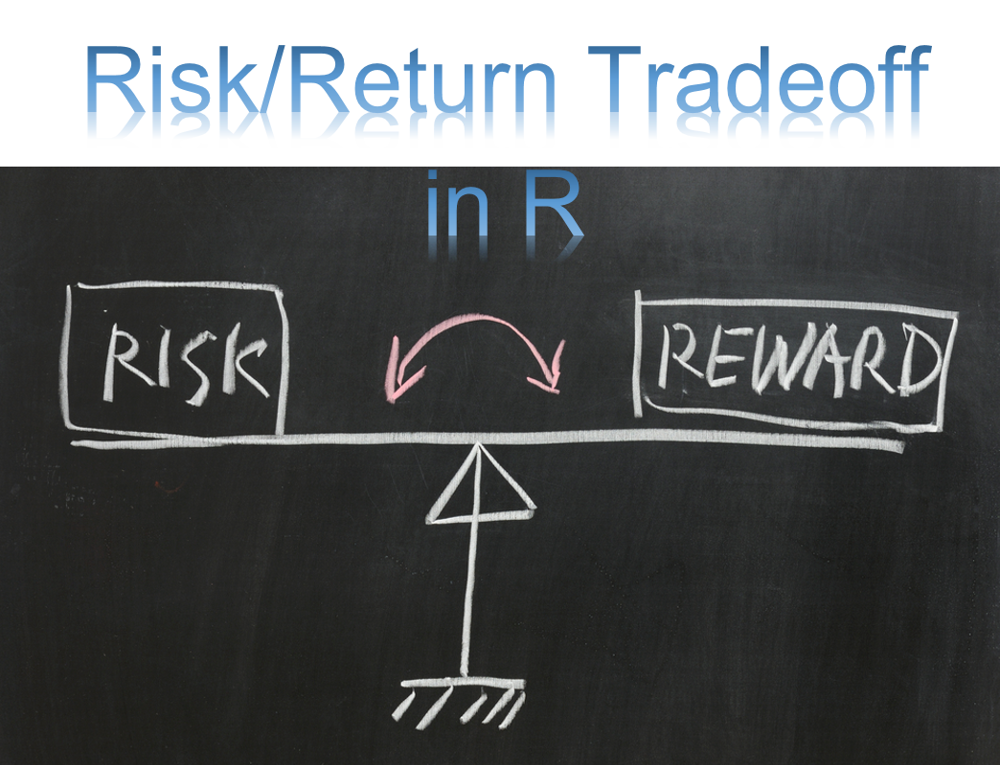

  

# Risk-Adjusted Return Ratios

## Description:  
### Risk-adjusted return measures how much risk is associated with producing a certain return. The Risk-adjusted return is used in order to measure that how much return an investment portfolio is generating in comparison to the risk involved, which is expressed generally as a number, and the same can be applied to investment funds, individual securities, and the investment portfolios, etc.  

#### Packages 'PerformanceAnalytics'  
### https://cran.r-project.org/web/packages/PerformanceAnalytics/PerformanceAnalytics.pdf  

## Author:  
### * Tin Hang  
## 🔴 Warning: This is not financial advice. Do not rely on it for investment or trading decisions. It is for educational purposes only.  
