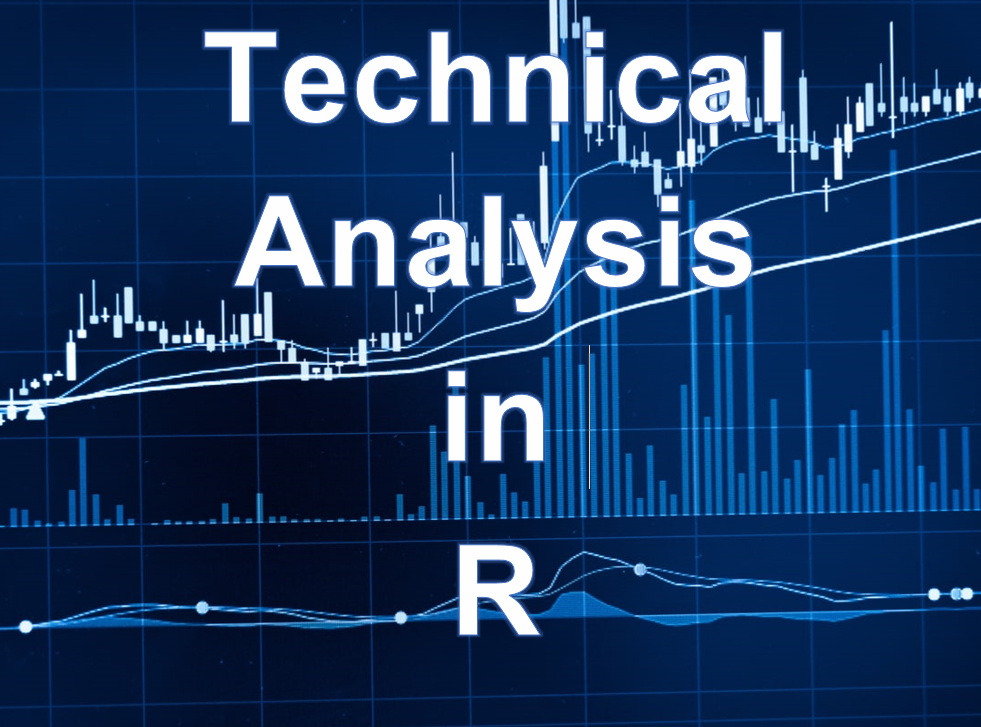

 
  
# Technical Analysis Indicators    

### Description: Technical Analysis (TA) is a methodology for analyzing securities prices and predicting or forecasting future prices using TA indicators. TA is commonly employed in investment to identify trading opportunities by analyzing price trends and patterns visible on charts.    

## Will Add more indicators.  

## I hope you enjoy learning about technical indicators.  

## Author:  
### * Tin Hang  

## References
https://www.investopedia.com/  
https://stockcharts.com/school/doku.php?id=chart_school:technical_indicators  
https://www.tradingtechnologies.com/xtrader-help/x-study/technical-indicator-definitions/list-of-technical-indicators/  
https://library.tradingtechnologies.com/trade/chrt-technical-indicators.html  
https://www.metatrader4.com/en/trading-platform/help/analytics/tech_indicators  
https://www.incrediblecharts.com/indicators/momentum_indicators.php  
https://www.fmlabs.com/reference/default.htm  
https://www.barchart.com/education/technical-indicators/mcginley_dynamic  
https://www.danielstrading.com/education/technical-analysis-learning-center  
https://www.marketvolume.com/technicalanalysis/  
