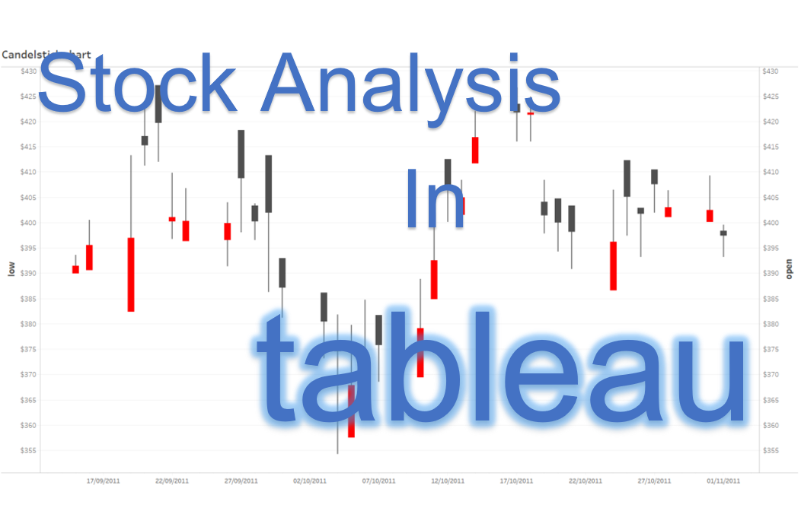

# Tableau for Stock Trading and Investment  
### Software:  
#### Tableau is a software and visual analytics platform that transforms how we use data to solve problems. It can handle larger datasets than Excel and does so more efficiently. Tableau is used to analyze and understand data, allowing users to create interactive dashboard.   
### Description:
#### Stock analysis in Tableau is a method that investors (both short-term and long-term) and traders use to make buying and selling decisions. It involves studying and evaluating past and current historical data, fundamental data, news, and social media. Investors and traders aim to gain a competitive advantage in the market by making informed decisions. :chart_with_upwards_trend: :chart_with_downwards_trend:  

### Tableau with Python
#### TabPy  
https://www.tableau.com/developer/tools/python-integration-tabpy  

### Tableau with R
#### R Integration  
https://www.tableau.com/developer/tools/r-integration  

### Download Software  
https://www.tableau.com/products/desktop/download  

<h3 align="left"> Software:</h3>

  </a>  

## Author:  
### * Tin Hang  

## 🔴 Warning: This is not financial advice. Do not rely on it for investment or trading decisions. It is for educational purposes only.   
